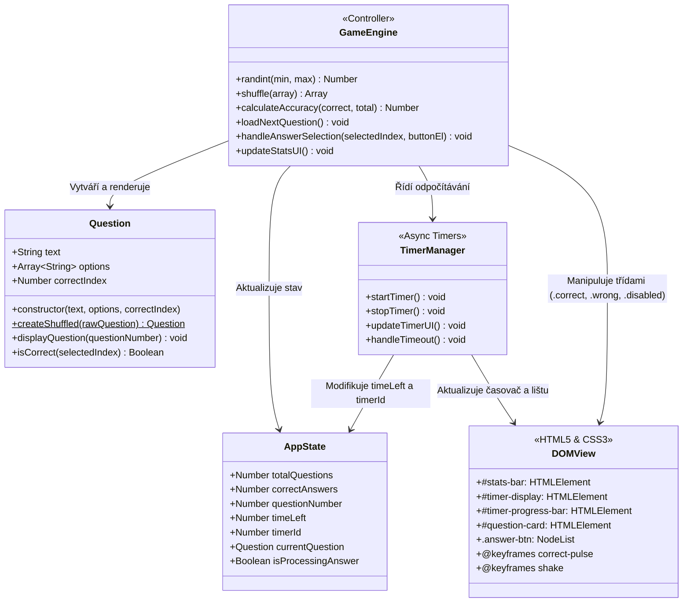

# 🧠 QuizApp v2: Dynamika, Časovač a Animace

Výuková interaktivní webová kvízová aplikace zaměřená na dynamické generování otázek, asynchronní odpočítávací časovač (`setInterval`, `clearInterval`, `setTimeout`), náhodné míchání polí (Fisher-Yates shuffle), výpočet statistik v reálném čase a CSS3 animace vizuální zpětné vazby (`@keyframes`).

Tato fáze představuje **2. fázi (dynamickou a plně interaktivní aplikaci)**, která plynule navazuje na 1. fázi statického prototypu. Rozšiřuje aplikaci o herní mechaniky, limit reakčního času a okamžité hodnocení odpovědí.

---

## 🎯 Klíčová témata a výukové cíle

* **JavaScript Matematika & Náhodnost (`Math` objekt)**:
  * Generování náhodných celých čísel v rozsahu (`Math.random()`, `Math.floor()`, pomocná funkce `randint(min, max)`).
  * Náhodné promíchání možností odpovědí pomocí Fisher-Yates (Knuth) shuffle algoritmu.
  * Matematické zaokrouhlování úspěšnosti (`Math.round()`).
* **Asynchronní JavaScript & Časovače**:
  * Implementace běžícího odpočítávacího časovače (`setInterval`, `clearInterval`).
  * Automatické vyhodnocení otázky při vypršení časového limitu (10 sekund).
  * Časované přechody mezi otázkami s prodlevou na zobrazení animace (`setTimeout(..., 1500)`).
* **CSS3 Dynamické stavy & Animace (@keyframes)**:
  * Klíčové snímky pro zelený puls při úspěchu (`@keyframes correct-pulse`).
  * Klíčové snímky pro červený třes při chybě (`@keyframes shake`).
  * Stavové třídy `.correct`, `.wrong` a zablokování interakce `.disabled` (`pointer-events: none`).
  * Vizuální výstraha a lišta zbývajícího času.
* **Správa stavu aplikace (State Management)**:
  * Sledování celkového počtu zodpovězených otázek, správných voleb a aktuálního času.
  * Průběžná aktualizace DOM elementů bez nutnosti reloadu stránky.

---

## 📐 Architektura Aplikace (UML Diagram)



---

## 🧩 Struktura Projektu

```text
quiz-app-v2-dynamic/
├── index.html            # Vstupní stránka s ukazatelem času, statistikami a zadáním
├── styles.css            # Referenční styly s animacemi (@keyframes), stavy a časovačem
├── styles-students.css   # Pracovní studentská verze stylů s TODO úkoly pro animace
├── script.js             # Referenční JS logika s časovači, náhodností a statistikami
├── script-students.js    # Pracovní studentská verze JS s nápovědou a TODO úkoly
├── LICENSE               # Plný text licence GNU AGPL-3.0
├── README.md             # Tento didaktický průvodce s architekturou a návodem
└── docs/                 # Výukové podklady a taháky
    ├── quiz-app-v2-dynamic.md
    └── JS_matematika_casovace_CSS_animace_tahak.md
```

---

## 🚀 Jak s projektem pracovat

### 1. Spuštění referenční aplikace
1. Otevřete soubor [`index.html`](index.html) v libovolném moderním webovém prohlížeči (např. přes rozšíření *Live Server* ve VS Code).
2. Sledujte běžící časovač (10 s) a panel statistik v horní části.
3. Klikněte na odpověď před vypršením limitu:
   * **Správná odpověď:** Tlačítko se zbarví zeleně a jemně zapulzuje.
   * **Špatná odpověď:** Tlačítko se zatřese červeně a správná možnost se zeleně zvýrazní.
4. Po 1,5 sekundě aplikace automaticky načte další promíchanou otázku ze zásobníku a zresetuje časovač.

### 2. Přepnutí na studentskou pracovní verzi
V souboru [`index.html`](index.html) přepněte komentáře odkazů:

* **Pro styly** v sekci `<head>`:
  ```html
  <!-- <link rel="stylesheet" href="styles.css"> -->
  <link rel="stylesheet" href="styles-students.css">
  ```
* **Pro skript** před koncem `</body>`:
  ```html
  <!-- <script src="script.js"></script> -->
  <script src="script-students.js"></script>
  ```
* Postupujte podle číslovaných úkolů `TODO 1` až `TODO 5` v souboru [`styles-students.css`](styles-students.css) a `TODO 1` až `TODO 6` v souboru [`script-students.js`](script-students.js).

---

## 🎯 Co se student naučí

1. **Pracovat s náhodností a polem**: Porozumí funkci `Math.random()`, naučí se sestavit generátor náhodných celých čísel `randint()` a implementovat Fisher-Yates shuffle pro míchání pořadí odpovědí.
2. **Ovládat asynchronní časovače v JavaScriptu**: Zvládne opakovaný odpočet pomocí `setInterval()`, bezpečné zastavení přes `clearInterval()` a jednorázové zpoždění přechodů přes `setTimeout()`.
3. **Tvořit plynulé CSS3 animace**: Naučí se psát vlastní klíčové snímky `@keyframes` (puls, zatřesení) a propojovat je s dynamicky přidávanými třídami přes `classList.add()`.
4. **Spravovat herní stav**: Bude udržovat čistý stav aplikace (skóre, odehrané otázky, zbývající čas) a počítat statistiky úspěšnosti v reálném čase.
5. **Ošetřovat hraniční stavy**: Zvládne zablokování tlačítek během vyhodnocování (`pointer-events: none`) a reakci na vypršení časového limitu.

---

## ⚙️ Použité technologie & Požadavky

* **HTML5**: Sémantické elementy, přístupnostní atributy (ARIA regiony, live regions).
* **CSS3**: `@keyframes` animace, CSS Custom Properties (`var(--...)`), Flexbox / Grid layout, pseudo-třídy `:hover`, `:active`, `:focus-visible`.
* **JavaScript**: ECMAScript 2020+ (Třídy, Arrow functions, Destructuring, Spread syntax, Asynchronní časovače `setInterval`/`setTimeout`, DOM API).
* **Podporované prohlížeče**: Libovolný moderní prohlížeč (Google Chrome, Mozilla Firefox, Microsoft Edge, Safari) bez nutnosti instalace dalších balíčků.

---

## 👤 Autor a Licencování

**Autor:** Jakub Březa (Vlk samotář) – [VlkSamotar.cz](https://vlksamotar.cz) | Informatika | Trading | Elektrotechnika 

---

## 📜 Licence & Komerční využití

Tento projekt je šířen pod licencí **GNU Affero General Public License v3 (AGPL-3.0)** (viz přiložený soubor [LICENSE](LICENSE)).

### Co to znamená?
* **Pro studenty a samouky:** Projekt můžete volně používat, studovat a upravovat pro své osobní účely.
* **Pro lektory a vzdělávací organizace:** Můžete projekt využít při výuce, ale **pokud aplikaci (nebo její upravenou verzi) provozujete na síti/webu, musíte zachovat zdrojový kód otevřený pod stejnou licencí AGPL-3.0** a uvést původního autora.

### 💼 Máte zájem o komerční využití bez omezení AGPL?
Pokud chcete tento interaktivní playground integrovat do své komerční (uzavřené) platformy, e-learningu nebo máte zájem o white-label řešení pro vaši školu, kontaktujte mě na [VlkSamotar.cz](https://vlksamotar.cz) pro sjednání **komerční proprietární licence**.

---

## 🧩 Třetí strany a závislosti

* **Google Fonts (Lexend, Roboto)**: Šířeno pod otevřenou licencí [SIL Open Font License 1.1](https://openfontlicense.org/).
* Projekt je čistě nativní a nevyžaduje žádné npm balíčky, runtime frameworky ani bundlery.

